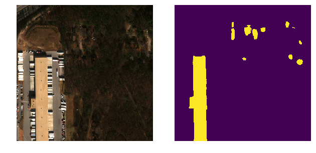

*building detector, some stuff in segmentation
___


What we have:
 - torch backend
 - using resnet34 encoder plus unet decoder
 - train on 256, 512, 1024 patches, sequentialy in order to avoid BN problems
 - Adam optimizer with reduce on plateau lr policy
 - soft dice loss
 - logger to log.log

---
Dependencies:
- `torch`
- `torchvision`
- `sklearn`
- `cv2`
- `numpy`
- `skimage`
---
Usage:
```bash
python train_resnet.py
```
For inference examples see `test model.ipynb`

TODO:
- [ ] try deeper model plus channel and spatial squeeze and excitation stuff from `say.py`
- [ ] try add some differen level of dilation (aka atrous conv) in center of the model
- [ ] use 2 channel inputs, 1st layer mask, 2nd should be building borders instead
